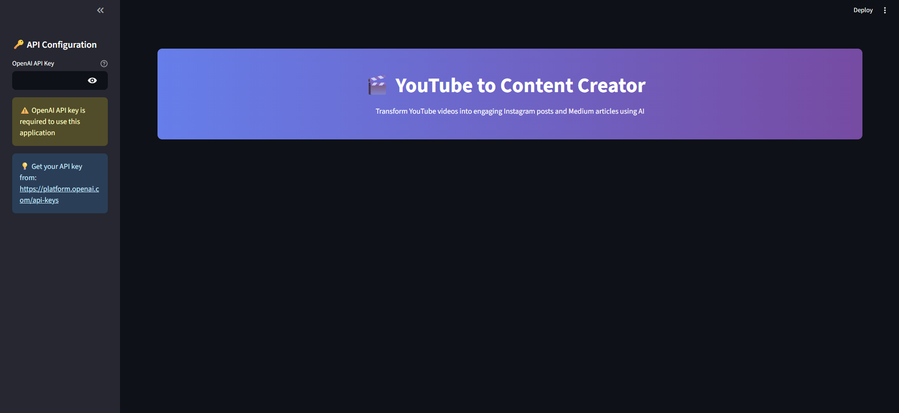
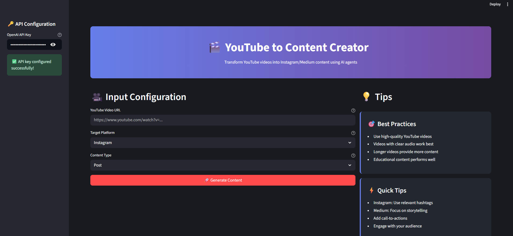
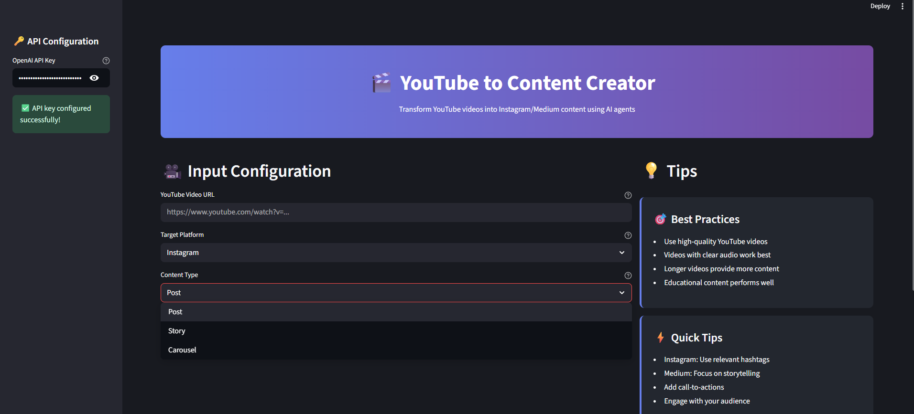
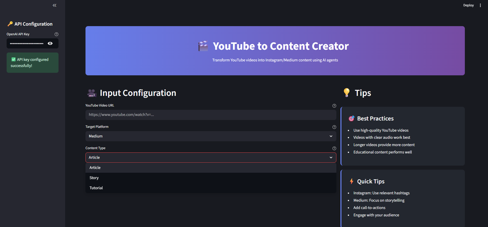
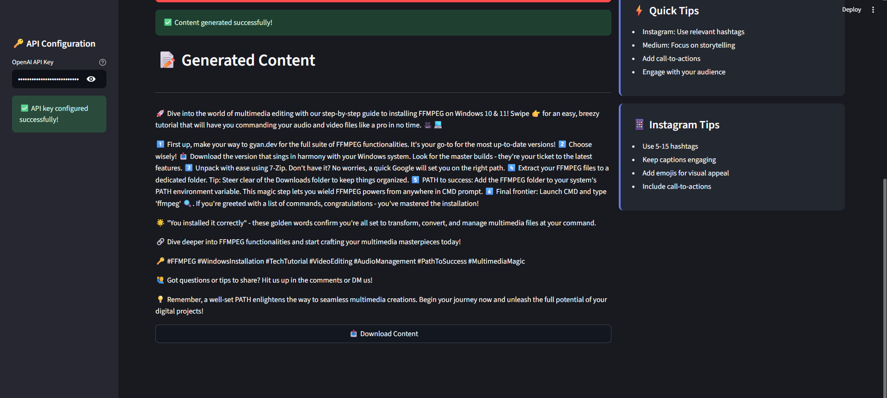

# YouTube to Content Creator

Transform YouTube videos into Instagram or Medium content using AI agents! This app leverages CrewAI, Streamlit, and quality APIs to generate high-quality, platform-optimized content from any YouTube video link.

---

## 🚀 Features
- **Multi-agent AI workflow**: Research, write, and optimize content using specialized CrewAI agents
- **YouTube video analysis**: Extracts transcript, title, description, and duration using `yt-dlp` (no API key required)
- **Platform selection**: Choose between Instagram (Post, Story, Carousel) or Medium (Article, Story, Tutorial)
- **User-supplied OpenAI API key**: No paid backend required; bring your own key
- **Downloadable output**: Get your content as a Markdown file
- **Modern UI**: Streamlit interface with dark mode, tips, and best practices
- **Modular codebase**: Easy to extend and maintain (see `agents.py`, `tasks.py`, `youtube_tools.py`, `ui.py`)

---

## 🛠️ Installation

1. **Clone the repository**
   ```bash
   git clone <repo-url>
   cd youtube_to_content_modular
   ```
2. **Install dependencies**
   ```bash
   pip install -r requirements.txt
   ```

---

## 🔑 Environment Setup
- No API keys are required for YouTube extraction (uses `yt-dlp`)
- You **must** provide your own OpenAI API key in the app sidebar to enable content generation
- Optionally, you can set `OPENAI_API_KEY` in a `.env` file for local development:
  ```env
  OPENAI_API_KEY=sk-...
  ```

---

## 💡 Usage
1. Start the app:
   ```bash
   streamlit run main.py
   ```
2. Enter your OpenAI API key in the sidebar
3. Paste a YouTube video URL
4. Select your target platform and content type
5. Click **Generate Content**
6. Review and download your AI-generated content!

---

## 🤖 Agent Workflow
- **Video Content Analyzer**: Extracts key insights, main points, and engaging content from the video transcript
- **Creative Content Writer**: Transforms insights into engaging, platform-optimized content
- **Platform Optimization Specialist**: Refines content for Instagram or Medium using best practices

Each agent only uses the actual video transcript and description—no generic or hallucinated content.

---

## 🧩 Code Structure
- `main.py` – App entry point and workflow
- `ui.py` – Streamlit UI components
- `youtube_tools.py` – YouTube video analysis and transcript extraction
- `agents.py` – CrewAI agent definitions
- `tasks.py` – CrewAI task definitions
- `logger.py` – Logging setup
- `requirements.txt` – Python dependencies

---

## 📝 Tips & Best Practices
- Use high-quality, clear-audio YouTube videos for best results
- Longer videos provide richer content
- Instagram: Use relevant hashtags, keep captions engaging
- Medium: Focus on storytelling and actionable insights

---

## 🐞 Troubleshooting
- **No transcript found**: Some videos may not have English subtitles; fallback is the video description
- **OpenAI API errors**: Ensure your API key is valid and has quota
- **App crashes or slow?**: Check your internet connection and try a different video
- **Logs**: See the `logs/app.log` file for detailed logs

---

## App Images











---

## 📄 License
MIT License 
